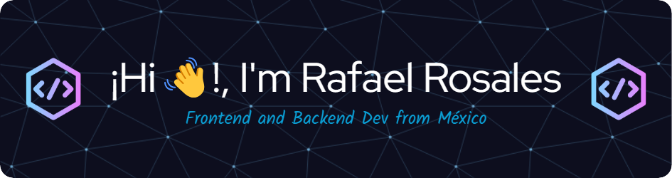

- 🔭 I’m currently working on [Sistema de Gestión de Seminarios](https://seminarioapp-frontendsakai.vercel.app/auth/login)

- 🌱 I’m currently learning **Astro, Vue, (React, Remix, Next.js)**

- 📫 How to reach me **rafael.rosales1405@gmail.com**

## :wrench: Languages and Tools

##  Languages and Frameworks

##  Tools

## :wrench: Github

&nbsp;

